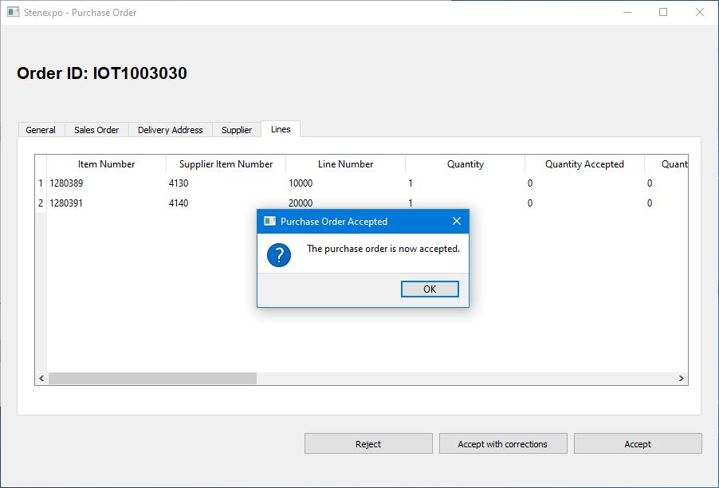

# Trademax API Client

## About

This GUI application was built specifically for a company called [Stenexpo](https://stenexpo.com).
The company is a supplier to [Trademax](https://trademax.com). The application communicates to Trademax REST API to be able to
accept, reject, correct, dispatch and send invoice of an purchase order.

## Technologies

The GUI application Trademax API Client uses:

* Python 3.8
* PyQT5 (5.15.1)
* QT .ui files

For additonal information regarding libraries, see file _requirements.txt_.

## Instructions to run the software

If not compiled to an executable, use the steps below to run it with Python interpreter:

1. Download and install Python >=3.8 on your OS.
2. Download the latest release here on Github and extract the files.
3. Go to the **src** directory and install the dependencies: `python -m pip install -r requirements.txt`
4. Edit the settings.ini file and put Trademax API credentials and application information.
5. Start the application: `python main.py`

## Instructions to compile to executable file

1. Todo...

## Screenshots

## License

The application is licensed under MIT.
